# GitHub LLM Actions System
## Engineering Design Document

## Table of Contents

1. [System Overview](#1-system-overview)
2. [Architecture](#2-architecture)
3. [Component Design](#3-component-design)
4. [Data Model](#4-data-model)
5. [Implementation Plan](#5-implementation-plan)
6. [Testing Strategy](#6-testing-strategy)
7. [Deployment and Operations](#7-deployment-and-operations)
8. [Concurrency Management](#8-concurrency-management)
9. [Error Handling Strategy](#9-error-handling-strategy)
10. [Schema Evolution](#10-schema-evolution)
11. [Appendix](#11-appendix)

---

## 1. System Overview

### 1.1 Purpose

The GitHub LLM Actions System is a framework that allows users to interact with a repository-based data system through natural language in GitHub issues. It provides a conversational interface powered by LLMs to help users execute operational tasks without having to understand the underlying data structures.

### 1.2 Key Features

- **Conversational UI via GitHub Issues**: Users interact with the system by creating issues or commenting on existing ones.
- **LLM-Guided Workflow**: An LLM guides users through the process, understanding intent and suggesting appropriate actions.
- **Domain-Driven Design**: Different business processes are modeled as separate domains with their own reducers and state management.
- **Redux-Inspired State Management**: State changes occur through well-defined actions processed by pure reducer functions.
- **GitHub-Based Infrastructure**: Uses GitHub for both UI (issues) and backend (Actions, file storage).
- **Flexible Side Effects System**: Can execute arbitrary async functions after state changes to perform side effects.
- **Approval Workflow**: Uses GitHub reactions (👍) as confirmation mechanism before executing actions.

### 1.3 User Experience Flow

1. A user creates an issue or comments on an existing one with a request.
2. The LLM bot reads the issue/comment and engages in a conversation to understand the request.
3. Once the bot understands the request, it proposes a specific action with all required parameters.
4. The user confirms by reacting with a 👍.
5. The system executes the action, updates the state, and executes any associated side effect functions.
6. The bot reports the outcome back to the issue.

### 1.4 Example Use Cases

This system can be applied to various operational domains where:
- Data is structured and can be managed through actions
- Users need guidance to perform the correct operations
- There's a need for approval workflows
- Operations may trigger additional side effects

Some example applications include:

**1. Team Management (Example in this document)**
- Adding/removing team members
- Creating new teams
- Managing team resources

**2. Infrastructure Access Control**
- Granting/revoking access to resources
- Provisioning development environments
- Managing cloud permissions

**3. Release Management**
- Initiating release processes
- Managing feature flags
- Coordinating deployment schedules

**4. Training Program Administration**
- Enrolling users in training programs
- Tracking completion status
- Issuing certifications

**5. System Configuration Management**
- Updating configuration parameters
- Rolling out feature toggles
- Managing service dependencies

---

## 2. Architecture

### 2.1 System Architecture Diagram


### 2.2 Component Diagram


### 2.3 Communication Flow

```mermaid
sequenceDiagram
    actor User
    participant Issues as GitHub Issues
    participant Actions as GitHub Actions
    participant LLM as LLM Engine
    participant Registry as Domain Registry
    participant Dispatcher as Action Dispatcher
    participant State as State Manager
    participant SideEffects as Side Effects Manager
    participant ExternalServices as External Services
    
    User->>Issues: Creates/comments on issue
    Issues->>Actions: Triggers workflow
    Actions->>LLM: Invokes LLM
    LLM->>Registry: Loads available domains/actions
    Registry-->>LLM: Returns domain metadata
    LLM->>State: Requests current state
    State-->>LLM: Returns state
    LLM-->>Issues: Responds to user
    loop Until action identified
        User->>Issues: Continues conversation
        Issues->>Actions: Triggers workflow
        Actions->>LLM: Invokes LLM
        LLM-->>Issues: Responds to user
    end
    LLM->>Issues: Proposes specific action
    User->>Issues: Confirms with 👍 reaction
    Issues->>Actions: Triggers workflow
    Actions->>Dispatcher: Dispatches action
    Dispatcher->>Registry: Finds appropriate reducer
    Registry-->>Dispatcher: Returns reducer
    Dispatcher->>State: Loads current state
    State-->>Dispatcher: Returns state
    Dispatcher->>Registry: Executes reducer
    Registry-->>Dispatcher: Returns new state
    Dispatcher->>State: Saves new state
    Dispatcher->>SideEffects: Executes side effects functions
    SideEffects->>ExternalServices: Makes external API calls
    Dispatcher-->>Issues: Confirms execution
```



---

## 3. Component Design

### 3.1 LLM Conversation Engine

**Purpose:** Manages the conversation with users, interprets their intentions, and proposes actions.

**Key Functionality:**
- Process user issues/comments
- Understand user intent
- Match intent to available actions
- Generate appropriate responses
- Propose specific actions

**Interface:**
```typescript
interface LLMEngine {
  processMessage(message: string, conversationHistory: string[]): Promise<string>;
  generateActionProposal(domain: string, action: string, params: any): string;
  extractAction(message: string): Action | null;
}
```

**Implementation Details:**
- Uses Claude API for natural language processing
- Constructs system prompts including domain documentation and current state
- Maintains conversation context

### 3.2 Domain Registry

**Purpose:** Discovers, loads, and manages domain reducers and their documentation.

**Key Functionality:**
- Discover domain reducers from filesystem
- Extract documentation and action definitions
- Provide domain information to LLM
- Execute reducers for actions

**Interface:**
```typescript
interface DomainRegistry {
  loadDomains(): Promise<void>;
  getDomainMetadata(domain?: string): DomainMetadata[];
  getReducer(domain: string): Reducer<any, any>;
  executeAction(domain: string, action: any): any;
  getSideEffectHandlers(domain: string, actionType: string): SideEffectHandler[];
  
  // Zod validation
  validateAction(domain: string, action: any): boolean | z.ZodError;
  getActionSchema(domain: string): z.ZodType;
  getStateSchema(domain: string): z.ZodType;
}

interface DomainMetadata {
  name: string;
  description: string;
  actions: ActionMetadata[];
}

interface ActionMetadata {
  type: string;
  description: string;
  params: ParamMetadata[];
  examples: string[];
}

interface ParamMetadata {
  name: string;
  type: string;
  description: string;
  required: boolean;
}
```

**Schema Validation Implementation:**
- Uses Zod for schema validation of both actions and state
- Extracts Zod schemas from domain reducers
- Validates actions against domain-specific action schemas before dispatch
- Ensures type safety at runtime

### 3.3 Action Dispatcher

**Purpose:** Routes actions to appropriate reducers and manages execution flow.

**Key Functionality:**
- Validate action against schema
- Find appropriate reducer for action
- Execute action with current state and GitHub context
- Manage side effects execution
- Log actions to domain-specific JSONL files

**Interface:**
```typescript
interface ActionDispatcher {
  dispatch(action: Action, githubContext: GitHubContext): Promise<DispatchResult>;
}

interface DispatchResult {
  success: boolean;
  newState?: any;
  error?: string;
  sideEffectResults?: SideEffectResult[];
}

interface Action {
  domain: string;
  type: string;
  payload: any;
}

interface GitHubContext {
  username: string;      // GitHub username who initiated the action
  repository: string;    // Repository name
  issueNumber?: number;  // Issue number if action came from an issue
  timestamp: string;     // When the action was initiated
  sha?: string;          // Commit SHA if relevant
}
```

**Implementation Details:**
- Manages transaction-like semantics for action execution
- Handles error conditions and rollbacks
- Coordinates with state manager and side effects manager

### 3.4 State Manager

**Purpose:** Handles loading, updating, and versioning of domain states using Git for state history, and maintains action logs.

**Key Functionality:**
- Load domain states from repository
- Save updated states with Git commits
- Log actions to domain-specific JSONL files
- Provide access to state history via Git
- Handle concurrent access

**Interface:**
```typescript
interface StateManager {
  getState(domain: string): Promise<any>;
  saveState(domain: string, state: any, action: Action, context: GitHubContext): Promise<void>;
  getStateHistory(domain: string, limit?: number): Promise<StateHistoryEntry[]>;
  compareStates(domain: string, commitSha1: string, commitSha2: string): Promise<StateDiff>;
  saveStateDirectly(domain: string, state: any, options: SaveStateOptions): Promise<void>;
  getActionLog(domain: string, limit?: number): Promise<ActionLogEntry[]>;
}

interface SaveStateOptions {
  skipSideEffects?: boolean;
  commitMessage?: string;
  skipActionLog?: boolean;
}

interface StateHistoryEntry {
  commitSha: string;
  timestamp: string;
  message: string;
  action: Action;
}

interface ActionLogEntry {
  action: Action;
  timestamp: string;
  username: string;
  resultingSha: string;
  metadata?: Record<string, any>;
}

interface StateDiff {
  added: string[];
  removed: string[];
  modified: string[];
  details: Record<string, { before: any; after: any }>;
}
```

**Implementation Details:**
- Stores states as JSON files in repository
- Uses Git commits for state change history
- Uses commit messages to store action information
- Uses GitHub SHA for optimistic concurrency control

### 3.5 Side Effects Manager

**Purpose:** Handles post-action side effects, executing async functions after state changes to perform operations like notifications, API calls, or other operations.

**Key Functionality:**
- Execute registered side effect handlers for specific actions
- Provide a consistent interface for side effect execution
- Support asynchronous operations
- Track side effect execution status

**Interface:**
```typescript
interface SideEffectsManager {
  processSideEffects(action: Action, oldState: any, newState: any): Promise<SideEffectResult[]>;
  registerSideEffect(domain: string, actionType: string, handler: SideEffectHandler): void;
}

interface SideEffectResult {
  handlerId: string;
  success: boolean;
  data?: any;
  error?: string;
}

interface SideEffectHandler {
  id: string;
  description: string;
  execute(context: SideEffectContext): Promise<any>;
}

interface SideEffectContext {
  action: Action;
  oldState: any;
  newState: any;
  services: {
    github: GitHubClient;
    // Other services can be added here
  };
}
```

**Implementation Details:**
- Executes side effect handlers asynchronously
- Provides rich context including old/new state and the action
- Supports various service integrations through the context
- Tracks and reports side effect execution status

### 3.6 GitHub API Client

**Purpose:** Interacts with GitHub API to manage issues, files, etc.

**Key Functionality:**
- Create/update files in repository
- Get file contents
- Manage issue comments

**Interface:**
```typescript
interface GitHubClient {
  getFileContent(path: string): Promise<string>;
  updateFile(path: string, content: string, message: string): Promise<void>;
  createIssueComment(issueNumber: number, body: string): Promise<void>;
}
```

**Implementation Details:**
- Uses GitHub API or GitHub Actions context
- Handles authentication and rate limiting
- Provides error handling and retries

### 3.7 Error Handler

**Purpose:** Centralizes error management, categorization, and recovery strategies.

**Key Functionality:**
- Categorize errors by type
- Format user-friendly error messages
- Implement retry mechanisms for transient errors

**Interface:**
```typescript
interface ErrorHandler {
  categorizeError(error: Error): ErrorCategory;
  formatErrorForUser(error: Error): string;
  withRetry<T>(operation: () => Promise<T>, maxRetries?: number): Promise<T>;
}

type ErrorCategory = 'RATE_LIMIT' | 'AUTH' | 'VALIDATION' | 'NOT_FOUND' | 'GENERAL';
```

**Implementation Details:**
- Categorizes common GitHub API and application errors
- Provides user-friendly error messages for common failures
- Implements exponential backoff for retrying transient errors

---

## 4. Data Model

### 4.1 Domain State with Zod Validation

Each domain has its own state file, stored as JSON in the repository. States are validated using Zod schemas:

```typescript
import { z } from 'zod';

// Base state interface with versioning
const VersionedStateSchema = <T extends z.ZodType>(dataSchema: T) => z.object({
  schemaVersion: z.number(),
  data: dataSchema
});

// Example team management state
const TeamSchema = z.object({
  description: z.string(),
  owner: z.string(),
  members: z.array(z.string()),
  createdAt: z.string().optional()
});

const TeamManagementStateSchema = VersionedStateSchema(
  z.object({
    teams: z.record(z.string(), TeamSchema)
  })
);

type TeamManagementState = z.infer<typeof TeamManagementStateSchema>;

// Example resource access state
const ResourceAccessStateSchema = VersionedStateSchema(
  z.object({
    resources: z.record(z.string(), z.object({
      description: z.string(),
      access: z.record(z.string(), z.enum(["read", "write", "admin"]))
    }))
  })
);

type ResourceAccessState = z.infer<typeof ResourceAccessStateSchema>;
```

### 4.2 Reducer Definition with Zod and Side Effects

Reducers are defined with metadata, Zod schemas for validation, a pure reducer function, and side effect handlers:

```typescript
interface Reducer<S, A extends z.ZodType> {
  // State schema
  stateSchema: z.ZodType<S>;
  
  // Initial state
  initialState: S;
  
  // Action schema (discriminated union)
  actionSchema: A;
  
  // Metadata
  metadata: {
    name: string;
    description: string;
    actions: {
      [actionType: string]: {
        description: string;
        params: {
          name: string;
          type: string;
          description: string;
          required: boolean;
        }[];
        examples: string[];
      }
    }
  };
  
  // Pure reducer function with GitHub context
  reduce: (state: S, action: z.infer<A>, context: GitHubContext) => S;
  
  // Side effect handlers
  sideEffects: {
    [actionType: string]: SideEffectHandler[];
  };
}

// Side effect handler interface
interface SideEffectHandler {
  id: string;
  description: string;
  execute: (context: SideEffectContext) => Promise<any>;
}

// Context passed to side effect handlers
interface SideEffectContext {
  action: Action;
  oldState: any;
  newState: any;
  githubContext: GitHubContext;  // GitHub context is now passed to side effects
  services: {
    github: GitHubClient;
    // Other services can be added here
  };
}

// GitHub context passed to reducers and side effects
interface GitHubContext {
  username: string;      // GitHub username who initiated the action
  repository: string;    // Repository name
  issueNumber?: number;  // Issue number if action came from an issue
  timestamp: string;     // When the action was initiated
  sha?: string;          // Commit SHA if relevant
}
```

### 4.3 Action Format with Zod Validation

Actions are dispatched in a standard format and validated with Zod schemas:

```typescript
// Base action schema
const BaseActionSchema = z.object({
  domain: z.string(),
  type: z.string(),
  payload: z.record(z.string(), z.any())
});

// Example action type for team management
const AddToTeamSchema = z.object({
  domain: z.literal('team-management'),
  type: z.literal('ADD_TO_TEAM'),
  payload: z.object({
    username: z.string(),
    teamName: z.string()
  })
});

const RemoveFromTeamSchema = z.object({
  domain: z.literal('team-management'),
  type: z.literal('REMOVE_FROM_TEAM'),
  payload: z.object({
    username: z.string(),
    teamName: z.string()
  })
});

// Combined action schema as discriminated union
const TeamActionSchema = z.discriminatedUnion('type', [
  AddToTeamSchema,
  RemoveFromTeamSchema,
  // other action types...
]);

type TeamAction = z.infer<typeof TeamActionSchema>;
```

### 4.4 Repository Structure

```
/
├── .github/
│   └── workflows/
│       └── llm-action-bot.yml          # Main workflow
├── lib/                                # Core framework
│   ├── llm/                            # LLM integration
│   │   ├── engine.ts
│   │   └── prompts.ts
│   ├── registry/                       # Domain registry
│   │   ├── discovery.ts
│   │   └── metadata.ts
│   ├── dispatcher/                     # Action dispatcher
│   │   ├── index.ts
│   │   └── validator.ts
│   ├── state/                          # State management
│   │   ├── manager.ts
│   │   └── git.ts                      # Git-based state operations
│   ├── sideEffects/                    # Side effects
│   │   ├── manager.ts
│   │   └── handlers/                   # Common side effect handlers
│   │       ├── github.ts
│   │       ├── notifications.ts
│   │       └── api.ts
│   ├── github/                         # GitHub integration
│   │   ├── client.ts
│   │   └── issue-handler.ts
│   ├── error/                          # Error handling
│   │   ├── handler.ts
│   │   └── types.ts
│   └── types.ts                        # Shared types
├── scripts/                            # Utility scripts
│   ├── replay-actions.ts               # Action replay utility
│   └── verify-domains.ts               # Domain verification
├── team-management/                    # Team Management domain
│   ├── state.json                      # Current state
│   ├── actions.jsonl                   # Action log file
│   ├── reducer.ts                      # Domain reducer
│   ├── reducer.test.ts                 # Reducer tests
│   ├── types.ts                        # Domain-specific types
│   ├── side-effects.ts                 # Domain-specific side effects
│   └── prompt.md                       # Domain-specific prompt
├── resource-access/                    # Resource Access domain
│   ├── state.json
│   ├── actions.jsonl                   # Action log file
│   ├── reducer.ts
│   ├── reducer.test.ts
│   ├── types.ts
│   ├── side-effects.ts
│   └── prompt.md
├── project-management/                 # Another domain example
│   ├── state.json
│   ├── actions.jsonl                   # Action log file
│   ├── reducer.ts
│   ├── reducer.test.ts
│   ├── types.ts
│   ├── side-effects.ts
│   └── prompt.md
├── config.ts                           # Global configuration
├── index.ts                            # Main entry point
├── package.json
└── tsconfig.json
```

---

## 5. Implementation Plan

### 5.1 Phase 1: Core Framework

#### 5.1.1 Setup Project Structure
- Create repository with domain-oriented structure
- Configure TypeScript with strict type checking
- Setup Jest for testing
- Configure GitHub Actions CI/CD

**Deliverables:**
- Repository with domain-oriented structure
- TypeScript configuration
- Testing framework setup
- Initial CI/CD pipeline

**Testing:**
- Unit tests for configuration loading
- CI pipeline verification

#### 5.1.2 Core Library Development
- Implement base types and interfaces
- Create GitHub client for file operations
- Build basic issue handler
- Implement error handling framework

**Deliverables:**
- Core types and interfaces
- GitHub API client
- Issue event handler
- Error handler implementation

**Testing:**
- Unit tests for GitHub client with mocked responses
- Type verification with TypeScript compiler
- Interface contract tests
- Error handling tests

#### 5.1.3 State Management
- Implement domain state loading/saving
- Use Git commits for state history tracking
- Build state diffing/comparison utilities
- Add schema versioning support

**Deliverables:**
- State manager implementation with Git integration
- Git-based state history utilities
- State diff visualization
- Schema versioning system

**Testing:**
- Unit tests with mocked Git responses
- Integration tests with actual Git operations
- Edge cases for concurrent modifications
- Schema versioning tests

### 5.2 Phase 2: Domain Registry and Reducers

#### 5.2.1 Domain Registry
- Implement domain discovery mechanism
- Create documentation extraction
- Build reducer loading system

**Deliverables:**
- Domain registry implementation
- Documentation parser
- Registry configuration

**Testing:**
- Unit tests for domain discovery
- Tests for documentation extraction
- Registry loading tests with sample domains

#### 5.2.2 Sample Domain Implementation
- Create a sample domain (e.g., team-management)
- Implement state structure and reducer
- Add domain-specific documentation
- Implement schema migrations

**Deliverables:**
- Sample domain implementation
- Reducer with pure functions
- Documentation for domain actions
- State migration functions

**Testing:**
- Comprehensive unit tests for reducer functions
- Property-based tests for state invariants
- Integration tests with state manager
- Migration path tests

### 5.3 Phase 3: Action System

#### 5.3.1 Action Dispatcher
- Implement action validation
- Create reducer execution pipeline
- Build result handling and error management
- Configure serial execution

**Deliverables:**
- Action dispatcher implementation
- Validation framework
- Error handling system
- GitHub Actions concurrency configuration

**Testing:**
- Unit tests for action validation
- Integration tests for reducer execution
- Error handling tests for various failure modes
- Concurrency tests

#### 5.3.2 Side Effects System
- Implement side effect handler registration system
- Create context object with necessary services
- Build execution pipeline for side effects
- Add monitoring and failure handling

**Deliverables:**
- Side effects manager implementation
- Context preparation utilities
- Common side effect handlers
- Result tracking and reporting

**Testing:**
- Unit tests for side effect registration and discovery
- Integration tests with mock services
- End-to-end tests verifying side effects execution

### 5.4 Phase 4: LLM Integration

#### 5.4.1 LLM Engine
- Set up Claude API integration
- Implement conversation management
- Create domain-specific prompting

**Deliverables:**
- LLM engine implementation
- Conversation context management
- Prompt template system

**Testing:**
- Unit tests with mocked LLM responses
- Integration tests with the actual API
- Prompt quality evaluation tests

#### 5.4.2 Action Parsing
- Implement action proposal generation
- Create action extraction from natural language
- Build confirmation workflow

**Deliverables:**
- Action parser implementation
- Natural language extraction utilities
- Confirmation workflow logic

**Testing:**
- Unit tests for action parsing
- Test suite with various phrasings
- Integration tests with sample conversations

### 5.5 Phase 5: Integration and Expansion

#### 5.5.1 GitHub Issues Integration
- Implement complete issue event handling
- Create reaction processing
- Build comment management system

**Deliverables:**
- Complete issue handler implementation
- Reaction processor
- Comment formatting utilities

**Testing:**
- End-to-end tests with GitHub API
- Integration tests for the complete flow
- Performance tests for response time

#### 5.5.2 Additional Domain Implementation
- Create additional domain examples
- Implement cross-domain operations
- Add domain-specific test suites

**Deliverables:**
- Additional domain implementations
- Cross-domain integration examples
- Expanded test coverage

**Testing:**
- Unit tests for new domains
- Integration tests for cross-domain workflows
- System tests for complex scenarios

---

## 6. Testing Strategy

### 6.1 Unit Testing

Unit tests will focus on individual components and functions:

- **Domain Registry**: Test discovery, loading, and documentation extraction
- **State Manager**: Test state loading, saving, and history tracking
- **Action Dispatcher**: Test action validation and execution
- **Reducers**: Test state transformation for all actions
- **Side Effect Handlers**: Test individual side effect handlers
- **Error Handler**: Test error categorization and retry mechanics

**Tools**: Jest, TypeScript

**Coverage Target**: 80%+

### 6.2 Integration Testing

Integration tests will verify component interactions:

- **LLM + Registry**: Test domain information feeding into LLM
- **Dispatcher + State**: Test action execution and state updates
- **Side Effects + Services**: Test side effect execution with services
- **Error Handler + Components**: Test error recovery flows

**Tools**: Jest, Nock (for API mocking)

### 6.3 End-to-End Testing

End-to-end tests will verify complete workflows:

- **Conversation Flow**: Test user conversation to action execution
- **GitHub Integration**: Test issue creation to state update
- **Side Effect Execution**: Test complete flow including side effects
- **Schema Migration**: Test successful state migrations

**Tools**: GitHub Actions, Custom test harness

### 6.4 Type Safety

TypeScript will be used throughout the project to ensure type safety:

- Strong typing for all interfaces and functions
- Generic types for reducers and states
- Type guards for runtime validation

**Tools**: TypeScript, ESLint

---

## 7. Deployment and Operations

### 7.1 Deployment Strategy

The system will be deployed as a GitHub App or GitHub Action:

1. **GitHub App**:
   - Provides better permissions model
   - Can be installed on multiple repositories
   - Requires external hosting

2. **GitHub Action**:
   - Simpler deployment
   - Runs within GitHub infrastructure
   - Limited by GitHub Actions minutes

The recommendation is to start with a GitHub Action for simplicity and migrate to a GitHub App if needed.

### 7.2 Configuration

The system will be configured through repository files:

- **`.github/workflows/llm-action-bot.yml`**: Main workflow configuration
- **`config/domains.yml`**: Domain configuration
- **`config/llm.yml`**: LLM configuration

### 7.3 Security Considerations

The system will handle sensitive operations, so security is critical:

- **Authentication**: Use GitHub tokens with minimal permissions
- **Authorization**: Verify user has appropriate permissions for actions
- **Secrets**: Store API keys as GitHub Secrets
- **Validation**: Validate all inputs before execution

### 7.4 Monitoring and Logging

The system will include monitoring and logging:

- **Logging**: Use GitHub Actions logs
- **Monitoring**: Create status check for actions
- **Alerts**: Set up notifications for failures

---

## 8. Concurrency Management

To prevent race conditions and ensure actions are processed in order, the system will use GitHub Actions' built-in concurrency controls.

### 8.1 Serial Execution Configuration

Configure the main workflow to run serially:

```yaml
# In .github/workflows/llm-action-bot.yml
name: LLM Action Bot

on:
  issues:
    types: [opened, edited]
  issue_comment:
    types: [created, edited]
  reaction:
    types: [created]

concurrency:
  group: ${{ github.workflow }}-${{ github.event.repository.id }}
  cancel-in-progress: false
```

This configuration ensures that:
- Only one action will be processed at a time
- Actions are queued in the order they are received
- No action is canceled while in progress

### 8.2 Domain-Specific Concurrency

For finer-grained control, implement domain-specific concurrency groups:

```yaml
concurrency:
  group: ${{ github.workflow }}-${{ github.event.repository.id }}-${{ inputs.domain }}
```

This allows concurrent processing of actions across different domains while maintaining serialization within each domain.

## 9. Error Handling Strategy

Error handling is important. When failures occur the system you build should make use of the Github Actions platform to share information well in artifacts and status updates. Ideally it'd be easy for the user to know what the error means. Github has some remedies like re-running actions. so if the user sees a certain kind of error, they might do that.

### 9.1 No Partial State Updates

Due to the use of pure reducer functions, partial state updates are not possible:

- Reducers either complete successfully or throw an exception
- If an error occurs during reducer execution, the state remains unchanged
- This guarantees that the state is always in a valid, consistent state
- There is no need for rollback mechanisms since state is only updated when the reducer completes successfully

### 9.2 Integration with Dispatcher

Integrate error handling with the action dispatcher. Maybe something like this.

```typescript
// lib/dispatcher/index.ts
dispatch = async (action: Action): Promise<DispatchResult> => {
  try {
    // Validate action
    this.validateAction(action);
    
    // Find reducer
    const reducer = this.registry.getReducer(action.domain);
    
    // Get current state
    const state = await this.errorHandler.withRetry(() => 
      this.stateManager.getState(action.domain)
    );
    
    // Execute reducer
    const newState = reducer(state, action);
    
    // Save state
    await this.errorHandler.withRetry(() => 
      this.stateManager.saveState(action.domain, newState, action)
    );
    
    // Process side effects
    const sideEffectResults = await this.sideEffectsManager.processSideEffects(
      action, 
      state, 
      newState
    );
    
    return { 
      success: true, 
      newState,
      sideEffectResults
    };
  } catch (error) {
    // Log error
    console.error(`Error dispatching action: ${error.message}`, {
      action,
      error
    });
    
    // Report error to user
    await this.github.createIssueComment(
      this.issueNumber,
      this.errorHandler.formatErrorForUser(error)
    );
    
    return { 
      success: false, 
      error: error.message 
    };
  }
}
```

## 10. Action Logging

To maintain a complete history of all actions taken in the system, we'll implement a JSONL-based action log in the repo.

### 10.1 Action Log Structure

Each domain will have its own JSONL log file that records every action taken:

```typescript
// Action log entry structure
interface ActionLogEntry {
  action: {
    domain: string;
    type: string;
    payload: any;
  };
  timestamp: string;
  username: string;
  resultingSha: string;
  metadata?: Record<string, any>;
}
```

### 10.2 Implementation in State Manager

The State Manager will handle both updating the state and appending to the action log:

```typescript
// lib/state/manager.ts
class StateManager {
  /**
   * Save state and log the action
   */
  async saveState(domain: string, state: any, action: Action, context: GitHubContext): Promise<void> {
    // Prepare paths
    const statePath = this.getStatePath(domain);
    const logPath = this.getActionLogPath(domain);
    
    // Create log entry
    const logEntry: ActionLogEntry = {
      action,
      timestamp: context.timestamp,
      username: context.username,
      resultingSha: '', // Will be filled after commit
      metadata: {
        issueNumber: context.issueNumber
      }
    };
    
    // Get the current log content
    let currentLog = '';
    try {
      currentLog = await this.git.getFileContent(logPath);
    } catch (error) {
      if (error.status !== 404) throw error;
      // If file doesn't exist, start with empty string
    }
    
    // Append the new log entry
    const updatedLog = currentLog + JSON.stringify(logEntry) + '\n';
    
    // Create a multi-file commit with both state and log updates
    const sha = await this.git.commitMultipleFiles([
      {
        path: statePath,
        content: JSON.stringify(state, null, 2),
      },
      {
        path: logPath,
        content: updatedLog,
      }
    ], `${action.type}: ${JSON.stringify(action.payload)}`);
    
    // Update the log entry with the resulting SHA and append it to the log
    logEntry.resultingSha = sha;
    
    // Note: In a real implementation, we might want to update the log file again
    // with the SHA, but for simplicity we're skipping that here
  }
  
  /**
   * Get action log entries for a domain
   */
  async getActionLog(domain: string, limit = 100): Promise<ActionLogEntry[]> {
    const logPath = this.getActionLogPath(domain);
    
    try {
      // Get the log file content
      const content = await this.git.getFileContent(logPath);
      
      // Split by newlines and parse each line as JSON
      const entries = content
        .split('\n')
        .filter(line => line.trim() !== '')
        .map(line => JSON.parse(line) as ActionLogEntry)
        .reverse() // Most recent first
        .slice(0, limit);
        
      return entries;
    } catch (error) {
      if (error.status === 404) {
        return []; // Return empty array if log doesn't exist yet
      }
      throw error;
    }
  }
  
  /**
   * Get the path to the action log file for a domain
   */
  private getActionLogPath(domain: string): string {
    return `${domain}/actions.jsonl`;
  }
}
```

### 10.3 Replay and Audit Capabilities

The action log enables powerful capabilities:

1. **Audit Trail**: Complete history of who did what and when
2. **State Replay**: Ability to reconstruct state by replaying actions
3. **Analytics**: Insight into usage patterns and frequent operations
4. **Debugging**: Tracing the sequence of actions that led to a particular state


---

## 11. Appendix

### 11.1 Sample Implementation: Team Management Domain

```typescript
// team-management/types.ts

/**
 * Team Management Domain - Type Definitions
 */

/**
 * Team state structure
 */
export interface TeamState {
  data: {
    teams: {
      [teamName: string]: {
        description: string;
        owner: string;
        members: string[];
        createdAt: string;
      }
    }
  }
}

/**
 * Team action types
 */
export enum TeamActionTypes {
  ADD_TO_TEAM = 'ADD_TO_TEAM',
  REMOVE_FROM_TEAM = 'REMOVE_FROM_TEAM',
  CREATE_TEAM = 'CREATE_TEAM',
  UPDATE_TEAM_DESCRIPTION = 'UPDATE_TEAM_DESCRIPTION'
}

/**
 * Team action payloads
 */
export interface AddToTeamPayload {
  username: string;
  teamName: string;
}

export interface RemoveFromTeamPayload {
  username: string;
  teamName: string;
}

export interface CreateTeamPayload {
  teamName: string;
  description: string;
  owner: string;
}

export interface UpdateTeamDescriptionPayload {
  teamName: string;
  description: string;
}

// GitHub context type
export interface GitHubContext {
  username: string;      // GitHub username who initiated the action
  repository: string;    // Repository name
  issueNumber?: number;  // Issue number if action came from an issue
  timestamp: string;     // When the action was initiated
  sha?: string;          // Commit SHA if relevant
}

// team-management/reducer.ts

import { Action } from '../lib/types';
import { 
  TeamState, 
  TeamActionTypes,
  AddToTeamPayload,
  RemoveFromTeamPayload,
  CreateTeamPayload,
  UpdateTeamDescriptionPayload,
  GitHubContext
} from './types';
import { teamSideEffects } from './side-effects';

/**
 * Team Management Domain
 * 
 * This domain handles team membership and organization.
 */

/**
 * Initial state for teams
 */
export const initialState: TeamState = {
  data: {
    teams: {}
  }
};

/**
 * Team management reducer
 */
export function reducer(state: TeamState = initialState, action: Action, context: GitHubContext): TeamState {
  switch (action.type) {
    case TeamActionTypes.ADD_TO_TEAM: {
      const { username, teamName } = action.payload as AddToTeamPayload;
      
      // Validate team exists
      if (!state.data.teams[teamName]) {
        throw new Error(`Team ${teamName} does not exist`);
      }
      
      // Check if user already in team
      if (state.data.teams[teamName].members.includes(username)) {
        return state; // No change needed
      }
      
      console.log(`User ${context.username} is adding ${username} to team ${teamName}`);
      
      return {
        ...state,
        data: {
          ...state.data,
          teams: {
            ...state.data.teams,
            [teamName]: {
              ...state.data.teams[teamName],
              members: [...state.data.teams[teamName].members, username]
            }
          }
        }
      };
    }
    
    case TeamActionTypes.REMOVE_FROM_TEAM: {
      const { username, teamName } = action.payload as RemoveFromTeamPayload;
      
      // Validate team exists
      if (!state.data.teams[teamName]) {
        throw new Error(`Team ${teamName} does not exist`);
      }
      
      // Check if user is in team
      if (!state.data.teams[teamName].members.includes(username)) {
        return state; // No change needed
      }
      
      // Check if user has permission (e.g., is team owner or the user themselves)
      const isOwner = state.data.teams[teamName].owner === context.username;
      const isSelf = username === context.username;
      
      if (!isOwner && !isSelf) {
        throw new Error(`You don't have permission to remove ${username} from ${teamName}`);
      }
      
      return {
        ...state,
        data: {
          ...state.data,
          teams: {
            ...state.data.teams,
            [teamName]: {
              ...state.data.teams[teamName],
              members: state.data.teams[teamName].members.filter(member => member !== username)
            }
          }
        }
      };
    }
    
    case TeamActionTypes.CREATE_TEAM: {
      const { teamName, description, owner } = action.payload as CreateTeamPayload;
      
      // Validate team doesn't already exist
      if (state.data.teams[teamName]) {
        throw new Error(`Team ${teamName} already exists`);
      }
      
      // Note: Using the action initiator as the default owner if not specified
      const actualOwner = owner || context.username;
      
      return {
        ...state,
        data: {
          ...state.data,
          teams: {
            ...state.data.teams,
            [teamName]: {
              description,
              owner: actualOwner,
              members: [actualOwner], // Owner is automatically a member
              createdAt: context.timestamp // Use the GitHub context timestamp
            }
          }
        }
      };
    }
    
    case TeamActionTypes.UPDATE_TEAM_DESCRIPTION: {
      const { teamName, description } = action.payload as UpdateTeamDescriptionPayload;
      
      // Validate team exists
      if (!state.data.teams[teamName]) {
        throw new Error(`Team ${teamName} does not exist`);
      }
      
      // Check if user has permission (must be team owner)
      if (state.data.teams[teamName].owner !== context.username) {
        throw new Error(`Only the team owner can update the description`);
      }
      
      return {
        ...state,
        data: {
          ...state.data,
          teams: {
            ...state.data.teams,
            [teamName]: {
              ...state.data.teams[teamName],
              description
            }
          }
        }
      };
    }
    
    default:
      return state;
  }
}

// Define metadata about the reducer for the registry
export const metadata = {
  name: 'Team Management',
  description: 'Manages team membership and organization',
  actions: {
    [TeamActionTypes.ADD_TO_TEAM]: {
      description: 'Adds a user to a specified team',
      params: [
        {
          name: 'username',
          type: 'string',
          description: 'The username to add',
          required: true
        },
        {
          name: 'teamName',
          type: 'string',
          description: 'The team to add the user to',
          required: true
        }
      ],
      examples: [
        'ADD_TO_TEAM({ username: "jsmith", teamName: "frontend" })'
      ]
    },
    [TeamActionTypes.REMOVE_FROM_TEAM]: {
      description: 'Removes a user from a specified team',
      params: [
        {
          name: 'username',
          type: 'string',
          description: 'The username to remove',
          required: true
        },
        {
          name: 'teamName',
          type: 'string',
          description: 'The team to remove the user from',
          required: true
        }
      ],
      examples: [
        'REMOVE_FROM_TEAM({ username: "jsmith", teamName: "frontend" })'
      ]
    },
    [TeamActionTypes.CREATE_TEAM]: {
      description: 'Creates a new team',
      params: [
        {
          name: 'teamName',
          type: 'string',
          description: 'The name of the team to create',
          required: true
        },
        {
          name: 'description',
          type: 'string',
          description: 'Description of the team',
          required: true
        },
        {
          name: 'owner',
          type: 'string',
          description: 'Username of the team owner (defaults to the action initiator)',
          required: false
        }
      ],
      examples: [
        'CREATE_TEAM({ teamName: "new-project", description: "Team for the new project" })'
      ]
    },
    [TeamActionTypes.UPDATE_TEAM_DESCRIPTION]: {
      description: 'Updates a team description',
      params: [
        {
          name: 'teamName',
          type: 'string',
          description: 'The name of the team to update',
          required: true
        },
        {
          name: 'description',
          type: 'string',
          description: 'New description for the team',
          required: true
        }
      ],
      examples: [
        'UPDATE_TEAM_DESCRIPTION({ teamName: "frontend", description: "Frontend development team responsible for UI/UX" })'
      ]
    }
  }
};

export default {
  reducer,
  initialState,
  metadata,
  sideEffects: teamSideEffects
};

// team-management/side-effects.ts
import { TeamActionTypes } from './types';
import { SideEffectHandler, SideEffectContext } from '../lib/types';

// Side effect handler for notifying team members
const notifyTeamMembers: SideEffectHandler = {
  id: 'notify-team-members',
  description: 'Notifies team members when someone is added or removed',
  execute: async (context: SideEffectContext) => {
    const { action, newState, githubContext, services } = context;
    
    // Only run on ADD_TO_TEAM and REMOVE_FROM_TEAM actions
    if (![TeamActionTypes.ADD_TO_TEAM, TeamActionTypes.REMOVE_FROM_TEAM].includes(action.type)) {
      return;
    }
    
    const { teamName, username } = action.payload;
    const team = newState.data.teams[teamName];
    
    if (!team) {
      throw new Error(`Team ${teamName} not found`);
    }
    
    // Get all team members except the one being added/removed
    const membersToNotify = team.members.filter(member => member !== username);
    
    // Generate message
    const actionVerb = action.type === TeamActionTypes.ADD_TO_TEAM ? 'added to' : 'removed from';
    const message = `@${username} has been ${actionVerb} the ${teamName} team by @${githubContext.username}.`;
    
    // In a real implementation, this could send emails or other notifications
    console.log(`Notification: ${message} (To: ${membersToNotify.join(', ')})`);
    
    // You could use the GitHub client to post comments, create issues, etc.
    if (membersToNotify.length > 0 && githubContext.issueNumber) {
      await services.github.createIssueComment(
        githubContext.issueNumber,
        `Team update: ${message}`
      );
    }
    
    return {
      notifiedMembers: membersToNotify,
      message
    };
  }
};

// Side effect handler for provisioning resources
const provisionTeamResources: SideEffectHandler = {
  id: 'provision-team-resources',
  description: 'Sets up necessary resources when a team is created',
  execute: async (context: SideEffectContext) => {
    const { action, githubContext, services } = context;
    
    // Only run on CREATE_TEAM actions
    if (action.type !== TeamActionTypes.CREATE_TEAM) {
      return;
    }
    
    const { teamName } = action.payload;
    
    // In a real implementation, this could do things like:
    // 1. Create a team in GitHub
    // 2. Set up team repositories
    // 3. Configure CI/CD pipelines
    // 4. Provision cloud resources
    
    console.log(`Provisioning resources for new team: ${teamName} created by ${githubContext.username}`);
    
    // Example: Create a comment in the issue
    if (githubContext.issueNumber) {
      await services.github.createIssueComment(
        githubContext.issueNumber,
        `Resources for team "${teamName}" are being provisioned. This may take a few minutes.`
      );
    }
    
    // Simulate an async operation (e.g., API call to a cloud provider)
    await new Promise(resolve => setTimeout(resolve, 2000));
    
    // Could make async calls to various services here
    // const repo = await createGitHubRepo(teamName);
    // const bucket = await createS3Bucket(`${teamName}-assets`);
    // etc.
    
    return {
      team: teamName,
      creator: githubContext.username,
      resources: {
        repository: `${teamName}-repo`,
        channel: `#${teamName}`
      }
    };
  }
};

// Export all side effects for the team domain
export const teamSideEffects = {
  [TeamActionTypes.ADD_TO_TEAM]: [notifyTeamMembers],
  [TeamActionTypes.REMOVE_FROM_TEAM]: [notifyTeamMembers],
  [TeamActionTypes.CREATE_TEAM]: [provisionTeamResources]
};
```

### 11.2 Sample Implementation: Side Effects Manager

```typescript
// lib/sideEffects/manager.ts

import { Action } from '../types';
import { SideEffectHandler, SideEffectContext, SideEffectResult, GitHubContext } from '../types';
import { GitHubClient } from '../github/client';
import { ErrorHandler } from '../error/handler';

/**
 * Manages the execution of side effects after state changes
 */
export class SideEffectsManager {
  private registry: DomainRegistry;
  private github: GitHubClient;
  private errorHandler: ErrorHandler;
  
  constructor(
    registry: DomainRegistry,
    github: GitHubClient,
    errorHandler: ErrorHandler
  ) {
    this.registry = registry;
    this.github = github;
    this.errorHandler = errorHandler;
  }
  
  /**
   * Process all side effects for an action
   */
  async processSideEffects(
    action: Action, 
    oldState: any, 
    newState: any,
    githubContext: GitHubContext
  ): Promise<SideEffectResult[]> {
    // Get all side effect handlers for this action type
    const handlers = this.registry.getSideEffectHandlers(action.domain, action.type);
    
    if (!handlers || handlers.length === 0) {
      return [];
    }
    
    // Create the context object that will be passed to side effect handlers
    const context: SideEffectContext = {
      action,
      oldState,
      newState,
      githubContext,
      services: {
        github: this.github,
        // Add any other services that side effects might need
        // For example:
        // slack: this.slackClient,
        // email: this.emailService,
        // aws: this.awsClient
      }
    };
    
    // Execute all handlers and collect results
    const results = await Promise.all(
      handlers.map(handler => 
        this.invokeSideEffect(handler, context)
      )
    );
    
    return results;
  }
  
  /**
   * Execute a single side effect handler
   */
  private async invokeSideEffect(
    handler: SideEffectHandler, 
    context: SideEffectContext
  ): Promise<SideEffectResult> {
    try {
      console.log(`Executing side effect: ${handler.id} for action ${context.action.type}`);
      
      // Execute with retry capability for transient errors
      const data = await this.errorHandler.withRetry(() => 
        handler.execute(context)
      );
      
      console.log(`Side effect ${handler.id} completed successfully`);
      
      return {
        handlerId: handler.id,
        success: true,
        data,
        executedBy: context.githubContext.username,
        timestamp: new Date().toISOString()
      };
    } catch (error) {
      console.error(`Error executing side effect ${handler.id}:`, error);
      
      // For significant errors, we might want to notify the user
      if (context.githubContext.issueNumber) {
        await this.github.createIssueComment(
          context.githubContext.issueNumber,
          `⚠️ There was an error executing the "${handler.id}" side effect: ${error.message}`
        ).catch(e => console.error('Failed to post error comment:', e));
      }
      
      return {
        handlerId: handler.id,
        success: false,
        error: error.message,
        executedBy: context.githubContext.username,
        timestamp: new Date().toISOString()
      };
    }
  }
  
  /**
   * Register a custom side effect handler for a specific domain and action type
   */
  registerSideEffect(domain: string, actionType: string, handler: SideEffectHandler): void {
    this.registry.addSideEffectHandler(domain, actionType, handler);
  }
  
  /**
   * Run a one-time side effect outside the normal flow
   */
  async runSideEffect(
    handler: SideEffectHandler,
    action: Action,
    state: any,
    githubContext: GitHubContext
  ): Promise<SideEffectResult> {
    const context: SideEffectContext = {
      action,
      oldState: state,
      newState: state,
      githubContext,
      services: {
        github: this.github
        // Other services...
      }
    };
    
    return this.invokeSideEffect(handler, context);
  }
}
```